# 🧠 Beyond Sliding Windows: Learning to Manage Memory in Non-Markovian Environments

<p align="center">
  <a href="http://arxiv.org/abs/2512.19154"></a>
  <a href="https://openreview.net/pdf?id=W7O95Q1qzT"></a>
  
  
  
</p>
<p align="center">
  
</p>

## ✨ Overview

This repository contains the **official codebase** for the paper  
**[Beyond Sliding Windows: Learning to Manage Memory in Non-Markovian Environments](http://arxiv.org/abs/2512.19154)**.

We introduce **Adaptive Stacking**, a general, algorithm-agnostic alternative to fixed frame stacking (sliding windows) that allows agents to **actively control what information is remembered and forgotten**. Adaptive Stacking transforms memory from a passive architectural choice into a **learned decision-making problem** in partially observable and non-Markovian environments, enabling learning in continual environments and stronger generalization in big worlds.

**Key features:**
- 🔁 Drop-in replacement for frame stacking
- 🧩 Compatible with *any* RL algorithm and gymnasium environment
- ⚙️ Works with tabular, MLP, CNN, LSTM, and Transformer agents
- 📦 Seamless integration with Stable-Baselines3 and sb3-contrib
- 🧪 Extensive experiments across GridWorlds (Tmaze and XorMaze), MiniGrid, Fetch robot arm control, and Rubik's cube environments. 

---

## 📦 Installation

The code has been tested on **Ubuntu ≥ 20.04 LTS** with **Python 3.10**.

### Main Dependencies
- `gymnasium==1.0.0`
- `stable_baselines3==2.4.1`

To exactly reproduce our environment, use the provided Conda setup:

```bash
conda env create -f environment.yml
conda activate adaptivestack
````

---

## 🚀 Quick Start

Adaptive Stacking can be used **exactly like frame stacking (sliding windows)**. Simply wrap any gymnasium environment of interest using the AdaptiveStack wrapper in [envs/wrappers.py](envs/wrappers.py), then use any preferred RL algorithm to train. We also include a RecurrentPPO example of how to directly modify rollout buffers (see [algos/sb3_contrib_buffers.py](algos/sb3_contrib_buffers.py)) to use adaptive stacking instead of frame stacking.

### Minimal Example

```python
import gymnasium as gym
from stable_baselines3 import PPO

from envs.wrappers import FrameStack, AdaptiveStack
import envs.GridWorld

env = gym.make("tmaze-v0")
env = AdaptiveStack(env, num_stack=4)

model = PPO("MlpPolicy", env)
model.learn(10000)
```

That’s it! No algorithm changes required.

---

## 🧠 Supported Algorithms & Usage

Adaptive Stacking is **fully algorithm-agnostic** and has been tested with:

* ✅ Tabular Q-Learning
* ✅ PPO (MLP / CNN / LSTM / Transformer)
* ✅ RecurrentPPO (sb3-contrib's PPO with LSTM)

Two integration patterns are demonstrated:

1. **Wrapper-only**: AdaptiveStack augments the action space (wih memory actions) and observation space (with the memory stack).
2. **Wrapper + Buffer Modification**: Replaces sliding windows inside rollout buffers (e.g., RecurrentPPO).

Both mirror how frame stacking is typically used in modern RL pipelines.

---

## 🎮 Manual Control & Visualization

Interactively step through environments and **visualize the memory stack**.

> For clarity, we render the memory stack using RGB environment renders.
> If observations are RGB, add `--agent_view` to visualize the true observation stack.

### Examples

```bash
python manual_control.py --env tmaze-v0 --maze_length 3 --stack_type adaptive --num_stack 4
```

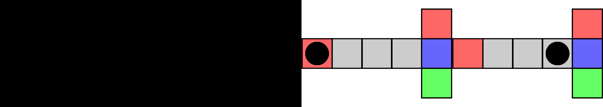

```bash
python manual_control.py --env MiniGrid-MemoryS17Random-v0 --stack_type framestack --num_stack 4 --seed 7
```

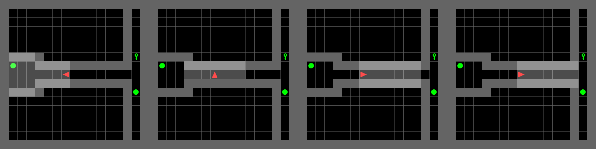

```bash
python manual_control.py --env MiniGrid-MemoryS17Random-v0 --stack_type framestack --num_stack 4 --seed 7 --agent_view
```

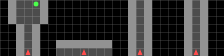

```bash
python manual_control.py --env cube-v0 --scramble_steps 0 --stack_type framestack --num_stack 10 --cube_cam orthographic
```

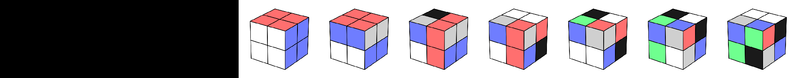

---

## 🏋️ Training & Evaluation

### 🔹 Q-Learning (Minimal Implementation)

```bash
python train.py --algo QL --env tmaze-v0 --maze_length 5 --stack_type adaptive --num_stack 2 --single_head
python train.py --algo QL --env tmaze-v0 --maze_length 5 --stack_type framestack --num_stack 2
```

```bash
python enjoy.py --algo QL --env tmaze-v0 --maze_length 5 --stack_type adaptive --num_stack 2 --single_head
python enjoy.py --algo QL --env tmaze-v0 --maze_length 5 --stack_type framestack --num_stack 2
```

<table>
  <tr>
    <td> <div style="position: absolute; top: 50%; right: 50%;">Train Passive-TMaze (L=3): Adaptive Stack (k=2)</div> 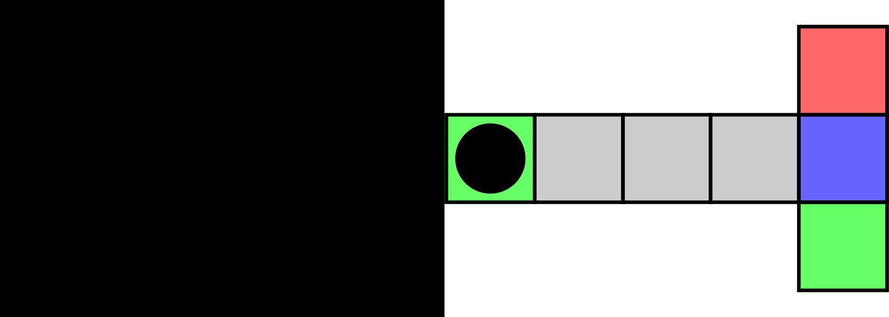</td>
    <td> <div style="position: absolute; top: 50%; right: 50%;">Train Passive-TMaze (L=3): Frame Stack (k=2)</div> </td>
  </tr>   
</table>

```bash
python enjoy.py --algo QL --env tmaze-v0 --maze_length 10 --stack_type adaptive --num_stack 2 --single_head --load_path ./data/QL-arch_mlp-env_passive_tmaze-v0_maze_length_10-random_length_False-num_stack_2-stack_type_adaptive-seed_None_values.npy
python enjoy.py --algo QL --env tmaze-v0 --maze_length 10 --stack_type framestack --num_stack 2 --single_head --load_path ./data/QL-arch_mlp-env_passive_tmaze-v0_maze_length_10-random_length_False-num_stack_2-stack_type_framestack-seed_None_values.npy
```
<table>
  <tr>
    <td> <div style="position: absolute; top: 50%; right: 50%;">Test Passive-TMaze (L=8): Adaptive Stack (k=2)</div> 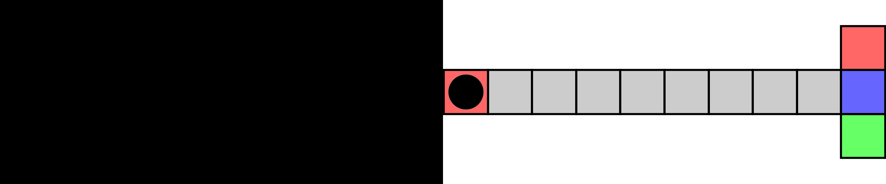</td>
    <td> <div style="position: absolute; top: 50%; right: 50%;">Test Passive-TMaze (L=8): Frame Stack (k=2)</div> 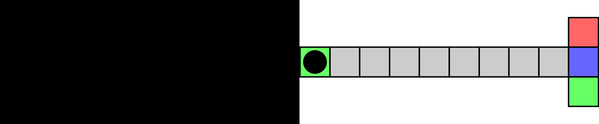</td>
  </tr>   
</table>

---

### 🔹 Stable-Baselines3

#### (1) RecurrentPPO (sb3-contrib)

Adaptive stacking is integrated **directly into the rollout buffer** used for LSTM's Backpropagation through time (BPTT), replacing sliding windows. While inference uses only the observation and recurrent hidden state, the visualisations bellow show the memory stack used for BPTT. 


```bash
python train.py --algo RecurrentPPO --env tmaze-v0 --maze_length 5 --stack_type adaptive --num_stack 2
python train.py --algo RecurrentPPO --env tmaze-v0 --maze_length 5 --stack_type framestack --num_stack 2
```
<table>
  <tr>
    <td> <div style="position: absolute; top: 50%; right: 50%;">Train Passive-TMaze (L=3): Adaptive Stack (k=2)</div> </td>
    <td> <div style="position: absolute; top: 50%; right: 50%;">Train Passive-TMaze (L=3): Frame Stack (k=2)</div> </td>
  </tr>   
</table>

<table>
  <tr>
    <td> <div style="position: absolute; top: 50%; right: 50%;">Test Passive-TMaze (L=8): Adaptive Stack (k=2)</div> </td>
    <td> <div style="position: absolute; top: 50%; right: 50%;">Test Passive-TMaze (L=8): Frame Stack (k=2)</div> </td>
  </tr>   
</table>


```bash
python train.py --algo RecurrentPPO --env tmaze-v0 --maze_length 5 --stack_type adaptive --num_stack 5
python train.py --algo RecurrentPPO --env tmaze-v0 --maze_length 5 --stack_type framestack --num_stack 5
```
<table>
  <tr>
    <td> <div style="position: absolute; top: 50%; right: 50%;">Train Passive-TMaze (L=3): Adaptive Stack (k=5)</div> 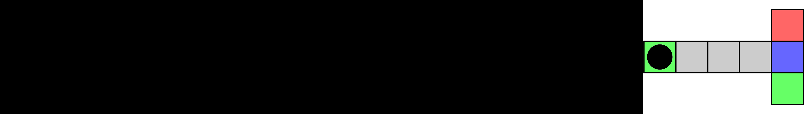</td>
    <td> <div style="position: absolute; top: 50%; right: 50%;">Train Passive-TMaze (L=3): Frame Stack (k=5)</div> 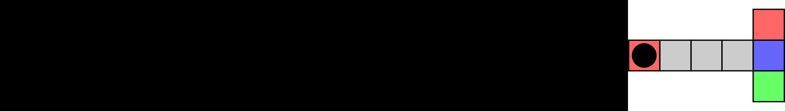</td>
  </tr>   
</table>

<table>
  <tr>
    <td> <div style="position: absolute; top: 50%; right: 50%;">Test Passive-TMaze (L=8): Adaptive Stack (k=5)</div> 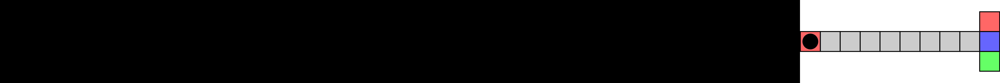</td>
    <td> <div style="position: absolute; top: 50%; right: 50%;">Test Passive-TMaze (L=8): Frame Stack (k=5)</div> 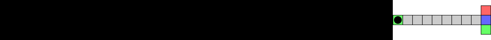</td>
  </tr>   
</table>

---

#### (2) PPO with LSTM Feature Extractor

Here, AdaptiveStack augments **both the action and observation spaces**.


```bash
python train.py --env FetchReachDense-v4 --algo PPO --n_steps 1024 --batch_size 1024 --arch mlp --stack_type framestack --num_stack 4
python train.py --env FetchReachDense-v4 --algo PPO --n_steps 1024 --batch_size 1024 --arch mlp --stack_type adaptive --num_stack 4
```
<table>
  <tr>
    <td> <div style="position: absolute; top: 50%; right: 50%;">FetchReachDense-v4: Adaptive Stack (k=4)</div> 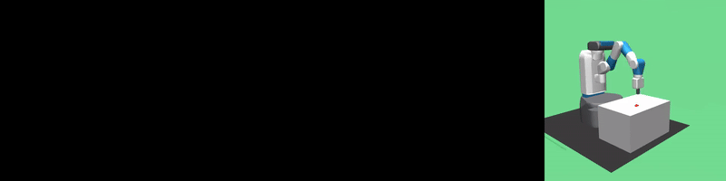</td>
    <td> <div style="position: absolute; top: 50%; right: 50%;">FetchReachDense-v4: Frame Stack (k=4)</div> </td>
  </tr>   
</table>

---

#### (3) PPO with CNN (MiniGrid)

```bash
python train.py --arch mlp --with_cnn --algo PPO --stack_type framestack --num_stack 2 --env MiniGrid-MemoryS17Random-v0 --n_envs 8 --features_dim 1024 --hidden_size 1024
python train.py --arch mlp --with_cnn --algo PPO --stack_type adaptive --num_stack 2 --env MiniGrid-MemoryS17Random-v0 --n_envs 8 --features_dim 1024 --hidden_size 1024
```
<table>
  <tr>
    <td> <div style="position: absolute; top: 50%; right: 50%;">MiniGrid-MemoryS17Random-v0: Adaptive Stack (k=2)</div> </td>
    <td> <div style="position: absolute; top: 50%; right: 50%;">MiniGrid-MemoryS17Random-v0: Frame Stack (k=2)</div> 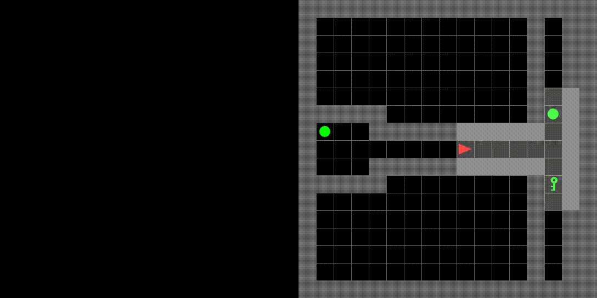</td>
  </tr>   
Agent observations
  <tr>
    <td> <div style="position: absolute; top: 50%; right: 50%;">MiniGrid-MemoryS17Random-v0: Adaptive Stack (k=2)</div> 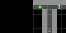</td>
    <td> <div style="position: absolute; top: 50%; right: 50%;">MiniGrid-MemoryS17Random-v0: Frame Stack (k=2)</div> </td>
  </tr>   
</table>

---

## 📚 Citation

If you find this work useful, please consider citing:

```bibtex
@inproceedings{tasse2025beyond,
  title     = {Beyond Sliding Windows: Learning to Manage Memory in Non-Markovian Environments},
  author    = {Tasse, Geraud Nangue and Riemer, Matthew and Rosman, Benjamin and Klinger, Tim},
  booktitle = {arXiv},
  year      = {2025}
}
```

---

## 🏆 Acknowledgements

This repository builds on and integrates with:

* **Gymnasium**
* **Stable-Baselines3**
* **sb3-contrib**

---

<p align="center">
  ⭐ If you find this repository useful, please consider starring it!
</p>
